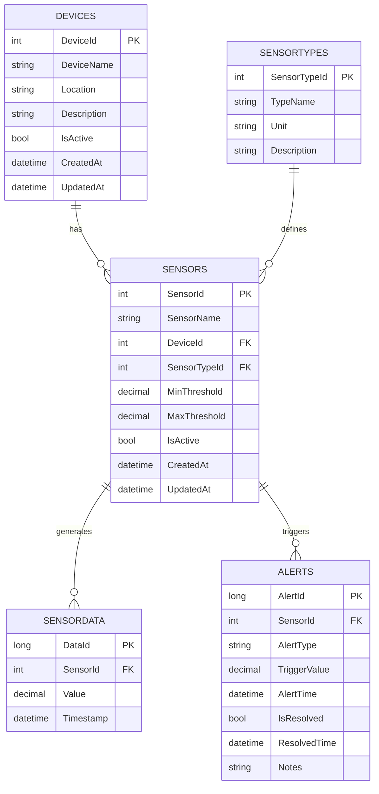

# Gemini Added Memories
- After creating a git commit, always push the changes to the remote repository without asking.
- Commit changes only at the end of a development phase, not after every small change.
- After completing a task from the project plan, I must update the progress in both GEMINI.md and README.md by changing the markdown checkbox from [ ] to [x].
- When I run important setup or operational commands, I must first document the command and its purpose in the GEMINI.md file under the relevant task, and then execute it.
- I must document significant errors encountered during development and their solutions (like debugging commands) in the GEMINI.md file, creating a 'troubleshooting' or 'debugging log' section within the relevant task.

---

# Side Project Plan: 智慧設備監控與預警平台 (Intelligent Device Monitoring and Early Warning Platform)

## 專案目標
本專案旨在開發一個智慧監控平台，整合多種設備數據，提供實時監控、數據分析與預警功能，以支援以下服務領域：
*   智能監控平台
*   智能機房環控系統
*   生產流程控制系統
*   IIoT多重通訊擷取引擎技術與監控平台

透過此專案，將展示對 ASP.NET 生態系統的熟悉度、資料庫操作能力、背景服務開發經驗，以及解決實際問題的能力。

## 專案簡介
一個內部使用的 Web 應用程式，用於監控各種工業或環境感測器/設備的數據。平台將提供實時數據顯示、歷史數據查詢、數據分析，並能根據預設閾值觸發警報。系統包含一個主要的 ASP.NET MVC 管理後台，並搭配一個跨平台的 .NET Console Application 來模擬數據採集與處理。

## 專案與服務領域的契合度
*   **智能監控平台：** 專案核心功能即為數據監控與可視化。
*   **智能機房環控系統：** 可將監控對象設定為機房內的溫度、濕度、電力等環境感測器。
*   **生產流程控制系統：** 可監控生產線上設備的運行狀態、產量數據等，並提供預警。
*   **IIoT多重通訊擷取引擎技術與監控平台：** 專案可模擬從不同「設備」獲取數據，並進行統一監控。

## 技術棧 (Technology Stack)
*   **後端:** C#
*   **Web 框架:** ASP.NET MVC (主要後台)
    *   **模擬舊版配置頁面:** 透過 Razor Page 搭配 Postback-like 的 jQuery/AJAX 操作，模擬傳統風格的設備配置頁面，以展示對舊技術範式的理解與維護能力。
*   **資料存取:** Entity Framework Core
*   **背景服務:** .NET Console Application (跨平台)
*   **前端:** HTML, CSS, JavaScript, jQuery (可整合圖表庫如 Chart.js 進行數據可視化)
*   **資料庫:** MS SQL Server
*   **版本控制:** Git

## 核心功能模組 (Features)

### 1. 設備與感測器管理 (Device & Sensor Management)
*   **功能描述:** 實現設備、感測器類型、監控參數及閾值的增、刪、改、查 (CRUD) 功能。
*   **對應技能:** ASP.NET MVC 的 Controller/View/Model 設計、Entity Framework Core 的資料操作、SQL Server 資料表設計。

### 2. 實時數據監控儀表板 (Real-time Monitoring Dashboard)
*   **功能描述:** 顯示各設備/感測器的實時數據、運行狀態，並提供可視化圖表。
*   **對應技能:** C# 後端數據處理、前端 HTML/CSS/JavaScript/jQuery 互動、數據可視化技術整合。

### 3. 歷史數據查詢與分析 (Historical Data Query & Analysis)
*   **功能描述:** 提供歷史數據的查詢、篩選功能，並能生成趨勢圖或簡單報表。
*   **對應技能:** T-SQL 複雜查詢、數據聚合、報表生成邏輯。

### 4. 數據採集模擬器與預警服務 (Data Acquisition Simulator & Alert Service)
*   **功能描述:** 一個獨立的 .NET Console Application，模擬從不同設備採集數據並寫入資料庫。同時，它會監測數據是否超出預設閾值，並觸發警報（例如：記錄警報事件）。
*   **對應技能:** C# Console Application 開發、資料庫連接與寫入、數據邏輯判斷、事件觸發。

### 5. 舊版設備配置頁面 (Legacy Device Configuration Page Simulation)
*   **功能描述:** 建立一個單獨的頁面，例如「傳統設備參數設定」。這個頁面刻意不使用現代前端框架，而是透過傳統的 HTML Form 提交和 jQuery/JavaScript 進行簡單的互動，模擬傳統 Web 應用程式的配置模式。
*   **對應技能:** 證明對傳統 Web 開發模式的理解，以及維護舊有系統配置的能力。

---

## 開發進度
- [x] 初始化專案結構 (ASP.NET MVC, .NET Console App)
- [x] 設計並建立 SQL Server 資料庫 (設備、感測器、數據、警報等資料表)
- [x] 實作設備與感測器管理模組 (CRUD)
- [x] 實作資料種子 (Data Seeding) - 透過 `src/SmartDeviceMonitoring.Web/Data/seeddata.json` 檔案和 `SeedData.cs` 類別在應用程式啟動時填充初始設備資料。
- [x] 開發數據採集模擬器與預警服務 (.NET Console App)
- [ ] 實作實時數據監控儀表板
- [ ] 實作歷史數據查詢與分析功能
- [ ] 實作舊版設備配置頁面 (模擬傳統風格)
- [ ] 撰寫單元測試 (如果時間允許)
- [ ] 部署專案 (例如到本地 IIS 或 Azure App Service)
- [ ] 準備專案說明文件/展示內容

---

## 專案資料夾結構 (Project Folder Structure)

```
/smart-device-monitoring-platform
├───GEMINI.md
├───.git/...
└───src/
    ├───SmartDeviceMonitoring.Web/
    └───SmartDeviceMonitoring.ConsoleApp/
```

---

## 資料庫結構規劃 (Database Schema Plan)

### 1. `Devices` Table (設備)
*   `DeviceId` (INT, Primary Key, IDENTITY): Unique identifier for the device.
*   `DeviceName` (NVARCHAR(255), NOT NULL): Name of the device (e.g., "Server Room AC Unit", "Production Line Machine 1").
*   `Location` (NVARCHAR(255), NULL): Physical location of the device.
*   `Description` (NVARCHAR(MAX), NULL): Detailed description of the device.
*   `IsActive` (BIT, NOT NULL, DEFAULT 1): Indicates if the device is currently active.
*   `CreatedAt` (DATETIME2, NOT NULL, DEFAULT GETDATE()): Timestamp when the device record was created.
*   `UpdatedAt` (DATETIME2, NOT NULL, DEFAULT GETDATE()): Timestamp when the device record was last updated.

### 2. `SensorTypes` Table (感測器類型)
*   `SensorTypeId` (INT, Primary Key, IDENTITY): Unique identifier for the sensor type.
*   `TypeName` (NVARCHAR(100), NOT NULL, UNIQUE): Name of the sensor type (e.g., "Temperature Sensor", "Humidity Sensor", "Pressure Sensor").
*   `Unit` (NVARCHAR(50), NULL): Unit of measurement (e.g., "°C", "%", "psi").
*   `Description` (NVARCHAR(MAX), NULL): Description of the sensor type.

### 3. `Sensors` Table (感測器)
*   `SensorId` (INT, Primary Key, IDENTITY): Unique identifier for the sensor.
*   `SensorName` (NVARCHAR(255), NOT NULL): Name of the sensor (e.g., "AC Unit Temp Sensor 1", "Machine 1 Pressure Sensor").
*   `DeviceId` (INT, Foreign Key to `Devices.DeviceId`, NOT NULL): The device this sensor belongs to.
*   `SensorTypeId` (INT, Foreign Key to `SensorTypes.SensorTypeId`, NOT NULL): The type of this sensor.
*   `MinThreshold` (DECIMAL(18, 2), NULL): Minimum acceptable value for this sensor.
*   `MaxThreshold` (DECIMAL(18, 2), NULL): Maximum acceptable value for this sensor.
*   `IsActive` (BIT, NOT NULL, DEFAULT 1): Indicates if the sensor is currently active.
*   `CreatedAt` (DATETIME2, NOT NULL, DEFAULT GETDATE()): Timestamp when the sensor record was created.
*   `UpdatedAt` (DATETIME2, NOT NULL, DEFAULT GETDATE()): Timestamp when the sensor record was last updated.

### 4. `SensorData` Table (監控數據)
*   `DataId` (BIGINT, Primary Key, IDENTITY): Unique identifier for the data point.
*   `SensorId` (INT, Foreign Key to `Sensors.SensorId`, NOT NULL): The sensor that collected this data.
*   `Value` (DECIMAL(18, 2), NOT NULL): The measured value from the sensor.
*   `Timestamp` (DATETIME2, NOT NULL, DEFAULT GETDATE()): Timestamp when the data was recorded.

### 5. `Alerts` Table (警報)
*   `AlertId` (BIGINT, Primary Key, IDENTITY): Unique identifier for the alert.
*   `SensorId` (INT, Foreign Key to `Sensors.SensorId`, NOT NULL): The sensor that triggered the alert.
*   `AlertType` (NVARCHAR(50), NOT NULL): Type of alert (e.g., "High Threshold Exceeded", "Low Threshold Exceeded", "Offline").
*   `TriggerValue` (DECIMAL(18, 2), NOT NULL): The value that triggered the alert.
*   `AlertTime` (DATETIME2, NOT NULL, DEFAULT GETDATE()): Timestamp when the alert was triggered.
*   `IsResolved` (BIT, NOT NULL, DEFAULT 0): Indicates if the alert has been resolved.
*   `ResolvedTime` (DATETIME2, NULL): Timestamp when the alert was resolved.
*   `Notes` (NVARCHAR(MAX), NULL): Any additional notes about the alert.

### Relationships:
*   `Devices` 1-to-Many `Sensors` (One device can have many sensors).
*   `SensorTypes` 1-to-Many `Sensors` (One sensor type can be associated with many sensors).
*   `Sensors` 1-to-Many `SensorData` (One sensor can generate many data points).
*   `Sensors` 1-to-Many `Alerts` (One sensor can trigger many alerts).

