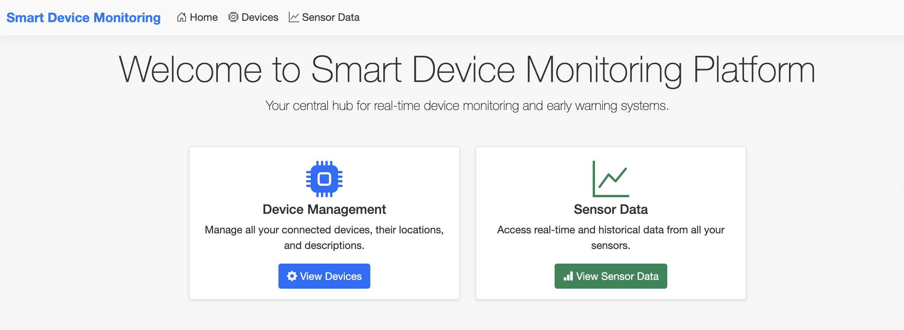
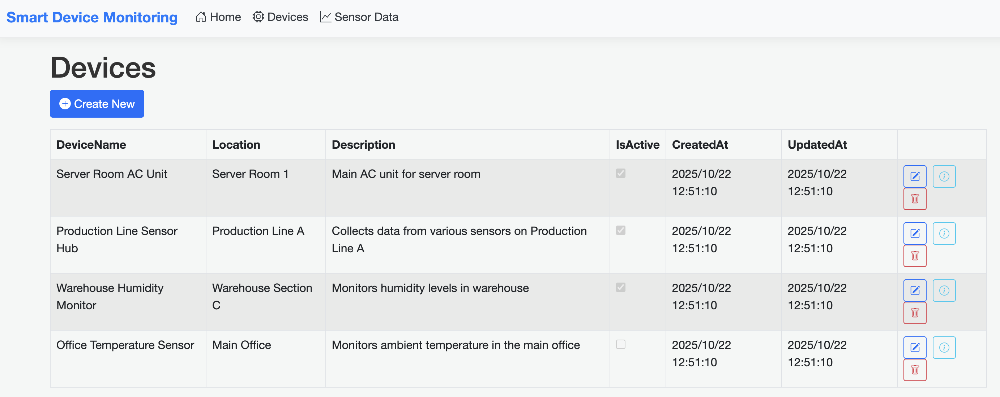
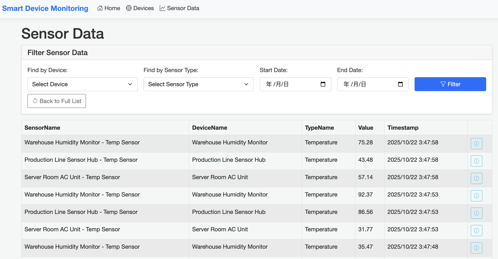
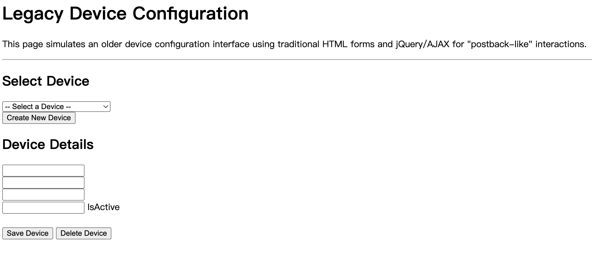

# Side Project Plan: 智慧設備監控與預警平台 (Intelligent Device Monitoring and Early Warning Platform)

## 專案目標
本專案旨在開發一個智慧監控平台，整合多種設備數據，提供實時監控、數據分析與預警功能，以支援以下服務領域：
*   智能監控平台
*   智能機房環控系統
*   生產流程控制系統
*   IIoT多重通訊擷取引擎技術與監控平台

透過此專案，將展示對 ASP.NET 生態系統的熟悉度、資料庫操作能力、背景服務開發經驗，以及解決實際問題的能力。

## 專案簡介
一個內部使用的 Web 應用程式，用於監控各種工業或環境感測器/設備的數據。平台將提供實時數據顯示、歷史數據查詢、數據分析，並能根據預設閾值觸發警報。系統包含一個主要的 ASP.NET MVC 管理後台，並搭配一個跨平台的 .NET Console Application 來模擬數據採集與處理。

## 專案與服務領域的契合度
*   **智能監控平台：** 專案核心功能即為數據監控與可視化。
*   **智能機房環控系統：** 可將監控對象設定為機房內的溫度、濕度、電力等環境感測器。
*   **生產流程控制系統：** 可監控生產線上設備的運行狀態、產量數據等，並提供預警。
*   **IIoT多重通訊擷取引擎技術與監控平台：** 專案可模擬從不同「設備」獲取數據，並進行統一監控。

## 技術棧 (Technology Stack)
*   **後端:** C#
*   **Web 框架:** ASP.NET MVC (主要後台)
    *   **模擬舊版配置頁面:** 透過 Razor Page 搭配 Postback-like 的 jQuery/AJAX 操作，模擬傳統風格的設備配置頁面，以展示對舊技術範式的理解與維護能力。
*   **資料存取:** Entity Framework Core
*   **背景服務:** .NET Console Application (跨平台)
*   **前端:** HTML, CSS, JavaScript, jQuery (可整合圖表庫如 Chart.js 進行數據可視化)
*   **資料庫:** MS SQL Server
*   **版本控制:** Git

## 核心功能模組 (Features)

### 1. 設備與感測器管理 (Device & Sensor Management)
*   **功能描述:** 實現設備、感測器類型、監控參數及閾值的增、刪、改、查 (CRUD) 功能。
*   **對應技能:** ASP.NET MVC 的 Controller/View/Model 設計、Entity Framework Core 的資料操作、SQL Server 資料表設計。

### 2. 實時數據監控儀表板 (Real-time Monitoring Dashboard)
*   **功能描述:** 顯示各設備/感測器的實時數據、運行狀態，並提供可視化圖表。
*   **對應技能:** C# 後端數據處理、前端 HTML/CSS/JavaScript/jQuery 互動、數據可視化技術整合。

### 3. 歷史數據查詢與分析 (Historical Data Query & Analysis)
*   **功能描述:** 提供歷史數據的查詢、篩選功能，並能生成趨勢圖或簡單報表。
*   **對應技能:** T-SQL 複雜查詢、數據聚合、報表生成邏輯。

### 4. 數據採集模擬器與預警服務 (Data Acquisition Simulator & Alert Service)
*   **功能描述:** 一個獨立的 .NET Console Application，模擬從不同設備採集數據並寫入資料庫。同時，它會監測數據是否超出預設閾值，並觸發警報（例如：記錄警報事件）。
*   **對應技能:** C# Console Application 開發、資料庫連接與寫入、數據邏輯判斷、事件觸發。

### 5. 舊版設備配置頁面 (Legacy Device Configuration Page Simulation)
*   **功能描述:** 建立一個單獨的頁面，例如「傳統設備參數設定」。這個頁面刻意不使用現代前端框架，而是透過傳統的 HTML Form 提交和 jQuery/JavaScript 進行簡單的互動，模擬傳統 Web 應用程式的配置模式。
*   **對應技能:** 證明對傳統 Web 開發模式的理解，以及維護舊有系統配置的能力。

---

## 資料庫遷移 (Database Migrations)

本專案使用 Entity Framework Core 的資料庫遷移功能來管理資料庫結構的變更。當資料模型 (Models) 發生變化時，需要執行以下步驟來更新資料庫：

1.  **建立遷移 (Add Migration):**
    當您修改了 `Models` 資料夾下的任何實體類別 (例如 `Device.cs`, `Sensor.cs` 等)，或者對資料庫上下文 (`ApplicationDbContext.cs`) 進行了更改時，需要建立一個新的遷移來記錄這些變更。
    在 `src/SmartDeviceMonitoring.Web` 目錄下執行：
    ```bash
    dotnet ef migrations add [MigrationName]
    ```
    *   `[MigrationName]` 應該是一個描述本次變更的名稱，例如 `AddAlertTimeFieldToAlert`。
    *   這個命令會生成一個新的遷移檔案，其中包含了將資料庫從舊狀態更新到新狀態所需的 C# 程式碼。

2.  **更新資料庫 (Update Database):**
    建立遷移檔案後，需要將這些變更應用到實際的資料庫中。
    在 `src/SmartDeviceMonitoring.Web` 目錄下執行：
    ```bash
    dotnet ef database update
    ```
    *   這個命令會執行所有尚未應用到資料庫的遷移，從而更新資料庫結構以匹配最新的資料模型。
    *   在開發過程中，特別是當您與團隊成員協作時，定期執行此命令以確保您的本地資料庫是最新的狀態非常重要。

這些命令確保了資料庫結構與應用程式的資料模型保持同步，並且可以追蹤資料庫結構的歷史變更。

---

## 開發進度
- [x] 初始化專案結構 (ASP.NET MVC, .NET Console App)
- [x] 設計並建立 SQL Server 資料庫 (設備、感測器、數據、警報等資料表)
- [x] 實作設備與感測器管理模組 (CRUD)
- [x] 實作資料種子 (Data Seeding) - 透過 `src/SmartDeviceMonitoring.Web/Data/seeddata.json` 檔案和 `SeedData.cs` 類別在應用程式啟動時填充初始設備資料。
- [x] 開發數據採集模擬器與預警服務 (.NET Console App)
- [x] 實作實時數據監控儀表板
- [x] 實作歷史數據查詢與分析功能
- [x] 實作舊版設備配置頁面 (模擬傳統風格)
- [x] 前端優化：加入現代化漂亮的介面並截圖更新至 README.md
- [ ] 撰寫單元測試 (暫時跳過)
- [ ] 部署專案 (暫時跳過)
- [ ] 準備專案說明文件/展示內容

---

## 如何執行 Web 應用程式 (How to Run the Web Application)

1.  **啟動 SQL Server Docker 容器:**
    在專案根目錄下執行以下命令：
    ```bash
    docker-compose up -d
    ```
    這將啟動在 `docker-compose.yml` 中定義的 SQL Server 容器。首次運行可能需要下載映像。
    **請務必在 `docker-compose.yml` 中將 `SA_PASSWORD` 替換為您設定的實際密碼。**

2.  **更新 `appsettings.json` 中的資料庫連接字串 (如果尚未更新):** 
    確保 `src/SmartDeviceMonitoring.Web/appsettings.json` 中的 `DefaultConnection` 如下所示，並替換為您的密碼：
    ```json
    "DefaultConnection": "Server=localhost,1433;Database=SmartDeviceMonitoringDb;User Id=sa;Password=YourStrong@Password123;MultipleActiveResultSets=true;TrustServerCertificate=True"
    ```

3.  **執行 Web 應用程式:** 
    在專案根目錄下執行以下命令：
    ```bash
    dotnet run --project src/SmartDeviceMonitoring.Web/SmartDeviceMonitoring.Web.csproj
    ```
    應用程式啟動後，通常會自動在瀏覽器中打開 `https://localhost:70xx` (埠號可能不同) 或 `http://localhost:5xxx`。

4.  **停止 SQL Server Docker 容器:**
    當您完成開發時，可以在專案根目錄下執行以下命令來停止並移除容器：
    ```bash
    docker-compose down
    ```

---

## 如何執行 Console 應用程式 (How to Run the Console Application)

1.  **確保 SQL Server Docker 容器正在運行。** 您可以使用 `docker ps` 檢查其狀態。如果它沒有運行，請從專案根目錄使用 `docker-compose up -d` 啟動它。

2.  **執行 Console 應用程式:**
    在專案根目錄下執行以下命令：
    ```bash
    dotnet run --project src/SmartDeviceMonitoring.ConsoleApp/SmartDeviceMonitoring.ConsoleApp.csproj
    ```
    Console 應用程式將會持續模擬數據並檢查警報。您會在終端機中看到相關輸出。

3.  **停止 Console 應用程式:**
    要停止 Console 應用程式，請在運行它的終端機中按下 `Ctrl+C`。

---

## 頁面類型說明 (Page Type Explanation)

本專案的 Web 應用程式 (`SmartDeviceMonitoring.Web`) 旨在展示不同 Web 開發範式的實作能力，特別是現代 ASP.NET Core MVC 與模擬傳統 Web 應用程式風格的頁面之間的對比。

### 現代頁面 (Modern Pages)

*   **範例:** 設備管理頁面 (`/Devices`), 感測器數據頁面 (`/SensorData`)。
*   **相關檔案/資料夾:**
    *   `src/SmartDeviceMonitoring.Web/Controllers/DevicesController.cs`
    *   `src/SmartDeviceMonitoring.Web/Controllers/SensorDataController.cs`
    *   `src/SmartDeviceMonitoring.Web/Views/Devices/` (包含 `Index.cshtml`, `Details.cshtml`, `Create.cshtml`, `Edit.cshtml`, `Delete.cshtml`)
    *   `src/SmartDeviceMonitoring.Web/Views/SensorData/` (包含 `Index.cshtml`, `Details.cshtml`)
*   **技術特點:**
    *   **框架:** 基於 ASP.NET Core MVC 框架，利用其內建的 Model-View-Controller (MVC) 設計模式。控制器 (Controllers) 負責處理請求、業務邏輯和數據準備；視圖 (Views) 負責呈現 UI；模型 (Models) 負責數據結構和驗證。
    *   **渲染:** 主要採用伺服器端渲染 (Server-Side Rendering, SSR)，由伺服器生成完整的 HTML 頁面後發送給瀏覽器。
    *   **互動:** 透過 Razor Views、Tag Helpers、Model Binding 等現代 ASP.NET Core 功能實現。客戶端互動通常使用少量 JavaScript (如 jQuery) 進行增強，但核心邏輯仍在伺服器端處理。頁面導航通常涉及完整頁面重新載入，但透過 AJAX 可實現局部更新。
    *   **優勢:** 結構清晰，易於維護和測試，SEO 友好，啟動性能良好。
*   **目的:** 展示對現代 ASP.NET Core Web 開發框架、設計模式和最佳實踐的掌握。

### 舊版風格頁面 (Legacy-Style Pages)

*   **範例:** 舊版設備配置頁面 (`/LegacyDeviceConfig`)。
*   **相關檔案/資料夾:**
    *   `src/SmartDeviceMonitoring.Web/Pages/LegacyDeviceConfig.cshtml.cs` (Code-behind)
    *   `src/SmartDeviceMonitoring.Web/Pages/LegacyDeviceConfig.cshtml` (Razor Page)
*   **技術特點:**
    *   **框架:** 雖然仍運行在 ASP.NET Core 環境中，但刻意模擬了早期 Web 應用程式的互動模式，例如 ASP.NET Web Forms 或經典 ASP 應用程式。
    *   **渲染:** 採用 Razor Page 模型，但其客戶端互動模式模擬了傳統的「Postback」行為。
    *   **互動:** 嚴重依賴 jQuery 和傳統的 AJAX 呼叫來模擬表單提交和頁面局部更新，而非使用現代前端框架（如 React, Angular, Vue）來管理複雜的客戶端狀態和 UI 渲染。每次互動後，頁面可能會模擬部分或全部重新載入，或者透過 AJAX 請求伺服器端渲染的 HTML 片段來更新內容。頁面邏輯通常更緊密地耦合在單個頁面檔案及其 Code-behind 中。
    *   **優勢:** 對於簡單的表單操作和數據展示，開發速度快；對於熟悉傳統 Web 開發的開發者來說，學習曲線較低。
    *   **劣勢:** 隨著應用程式複雜度增加，維護性可能下降；客戶端體驗不如現代 SPA 流暢。
*   **目的:** 證明對傳統 Web 開發模式的深入理解，以及在現代環境中維護、理解和擴展舊有系統的能力。這在許多企業環境中是一項寶貴的技能，因為現有系統可能採用較舊的技術和互動範式。

---

## 介面截圖 (Interface Screenshots)

以下是平台主要頁面的截圖，展示了現代化的介面設計。

### 首頁儀表板 (Home Dashboard)


### 設備管理 (Device Management)


### 感測器數據 (Sensor Data)


### 舊版設備配置頁面 (Legacy Device Configuration Page)


---